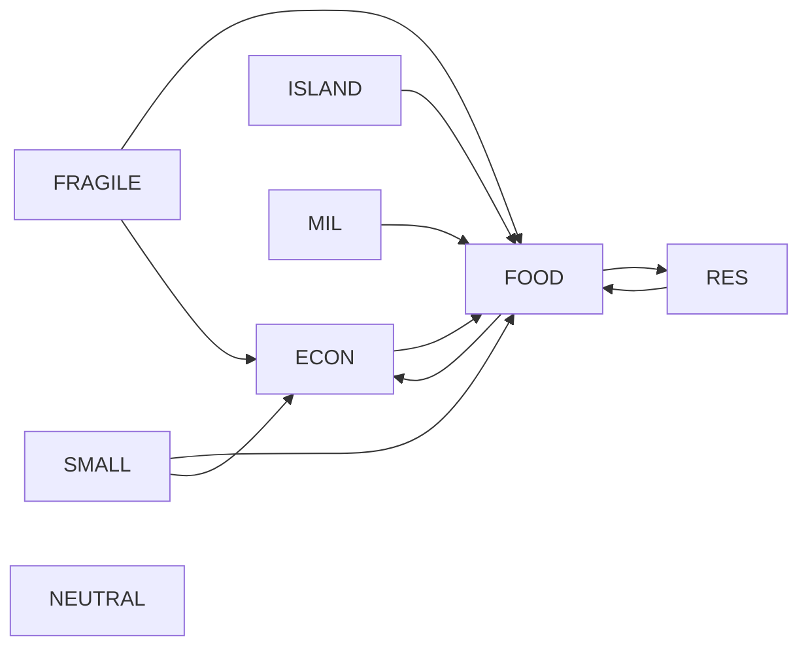

# 1TURN conditional settlement audit: 20260916T233557Z-2a8367e6

API calls during audit: 0. Saved run is historical evidence, not rewritten.

## Country answers and historical outcome

| Agent | response_id | conditions | choice_id | materialized action (recipient/resource/amount) | Historical outcome |
|---|---|---|---|---|---|
| ECON | CONDITIONAL | {"required_countries": ["FOOD"], "mutual_performance": true} | A005 | PROVIDE_FUNDS / FRAGILE / funds_economy / 10.0 | Not established: required FOOD absent from seeded participation set |
| FOOD | CONDITIONAL | {"required_countries": ["RES", "ECON"], "maximum_sovereignty_burden": 30, "mutual_performance": true} | A006 | SUPPORT_LOGISTICS / world_pool / logistics / 20.0 | Not established: required RES,ECON absent from seeded participation set |
| FRAGILE | CONDITIONAL | {"required_countries": ["FOOD", "ECON"]} | A002 | PROTECT_RESERVES / none / None / 0 | Not established: required FOOD,ECON absent from seeded participation set |
| ISLAND | CONDITIONAL | {"required_countries": ["FOOD"], "minimum_aid_amount": 10} | A001 | SUPPORT_LOGISTICS / world_pool / logistics / 10 | Not established: required FOOD absent from seeded participation set |
| MIL | CONDITIONAL | {"required_countries": ["FOOD"], "maximum_sovereignty_burden": 30, "mutual_performance": true} | A001 | SUPPORT_LOGISTICS / FRAGILE / logistics / 5.0 | Not established: required FOOD absent from seeded participation set |
| NEUTRAL | ACCEPT | {} | A001 | PROVIDE_RESOURCE / world_pool / food / 20.0 | Established: unconditional ACCEPT |
| RES | CONDITIONAL | {"required_countries": ["FOOD"], "maximum_sovereignty_burden": 30} | A012 | SUPPORT_LOGISTICS / world_pool / logistics / 20.0 | Not established: required FOOD absent from seeded participation set |
| SMALL | CONDITIONAL | {"required_countries": ["FOOD", "ECON"], "maximum_sovereignty_burden": 30} | A007 | PROVIDE_RESOURCE / world_pool / food / 10 | Not established: required FOOD,ECON absent from seeded participation set |

## Dependency graph (arrow means requires)

The strongly connected component is {ECON, FOOD, RES}. All three can participate simultaneously. With unconditional NEUTRAL included there are 17 condition-satisfying subsets: NEUTRAL alone, or NEUTRAL plus this component plus any subset of FRAGILE/ISLAND/MIL/SMALL (16 subsets). The maximal admissible set contains all eight countries.

## Contract evaluation and root cause

- required_countries: all dependencies exist in the full simultaneous candidate set.
- mutual_performance: ECON/FOOD/MIL require another participating country; all pass. It does not promise full requested quantities under resource contention.
- minimum_aid_amount: ISLAND own selected amount 10 >= 10. The advertised contract is own selected amount, not received or post-rationing aid.
- maximum_sovereignty_burden: FOOD 20 <= 30; MIL/RES/SMALL 25 <= 30. Others omit this constraint.
- deadline_turn: absent in all eight responses; no deadline restriction.
- Public reason text is not an additional executable condition. No response or choice ID was changed.

The old implementation grew a set seeded only by ACCEPT. It consulted previously admitted participants instead of the simultaneous candidate set, so the mutually consenting cycle could never enter. This was a fixed-point selection bug, not sensitivity to input dictionary order (the old loop sorted agents). Its mutual_performance check also required two predecessors, although the contract requires one other participant including the current candidate.

The correction starts with all ACCEPT/CONDITIONAL candidates and removes failing conditional candidates simultaneously until stable. The predicates are monotone under participation inclusion, so descending elimination yields the unique greatest admissible set in at most N removal rounds. Rejected or scalar-invalid candidates cannot enter; missing prerequisites cascade. Action feasibility is still strictly validated before any atomic mutation. No conditions were weakened. The legacy proposal API in coordination.py is separate from this run's Gemini action contract and is not changed.

## Historical state versus corrected offline replay

The saved world_pool food=20 and accepted_actions={NEUTRAL: PROVIDE_RESOURCE} exactly reproduce the old singleton settlement. unmet_resource_demand=0 counts unmet admitted draw/transfer requests; it does NOT claim all countries' needs were met or that conditional actions executed. Nonparticipating countries still experience ordinary network consumption, shock and baseline indicator evolution.

The historical singleton replay matches the complete saved settled state, including resources, indicators, causal record and research metrics. Reconstruction uses realized transfers only and is separately checked. An excluded-dependency counterfactual verifies that changing excluded actions to NO_ACTION changes no settled output: no partial action leakage.

Evaluator executed_true_state exactly matches the historical post-settlement state. Reconstruction is computed by the runner afterward, so its later-added reconstruction fields are excluded from that comparison and separately replayed. Evaluator consistency therefore does not validate the incorrect participation selection.

Corrected offline replay establishes all eight actions: ECON funds 10 to FRAGILE; MIL logistics 5 to FRAGILE; FOOD/RES/ISLAND logistics 20/20/10 to world pool; NEUTRAL/SMALL food 20/10 to world pool; FRAGILE PROTECT_RESERVES. Pool food=30, logistics=50, unmet admitted demand=0. These are counterfactual test outputs, not replacement research data.

## Regression coverage

The saved answers, initial states, network, original execution and evaluator payload are frozen in tests/fixtures/settlement_20260916T233557Z.json. All 40,320 answer permutations must produce the same complete corrected world state. All 256 country subsets independently verify the maximal admissible set. Additional cases cover rejection cascades, expired deadlines, insufficient own amounts, excess sovereignty burden, mutual participation, no partial effects, historical reconstruction and immutable source hashes.

The original 1TURN outcome is not a valid demonstration of simultaneous conditional settlement. Corrected code is ready for a separately authorized fresh validation, but this audit alone does not make the old run a valid gate for 8TURN. No experiment, API request or past-run modification was performed.

Verification: make check PASS (255 tests, offline preflight PASS, API calls 0). Source result, result audit and transport audit hashes unchanged. Fixture secret scan PASS.
