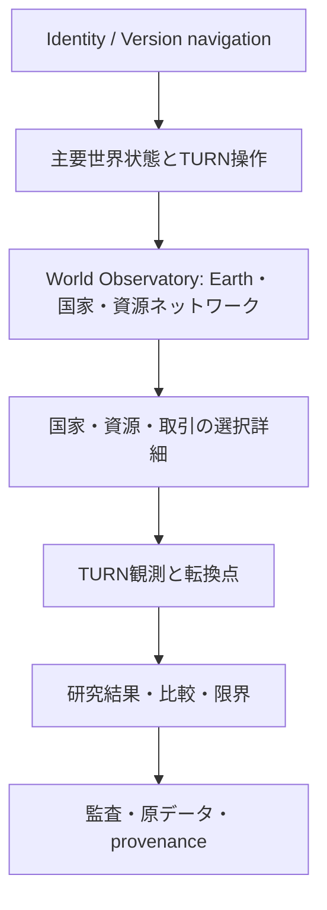

# V3 視覚構造・研究接続・実装段階案

> 2026-09-18レビュー更新：本書は初回設計の背景・出典資料として保持する。分類・配分規則・正式TURN・指標・実装段階の確定仕様は [IMPLEMENTATION_SPEC.md](IMPLEMENTATION_SPEC.md) を優先する。実装はユーザー確認待ち。

設計のみ。V1/V2の完成済み構造、Typography、copy、Earth、操作、System Field、recovery 2-column、TURN cards、Baselineを一切変更しない。

## 世界を先に見せる構造

V3は独立した入口として将来追加する。既存V1/V2のLOCKED nodeを移動・wrap・縮小して場所を作らない。既存content manifestにv3キーを追加しない。

Identity直下を長い解説で埋めない。上記はV3専用の新しい構造案であり、V1/V2のsection順序変更ではない。LOCKED frame（Identity、navigation、control、world）と承認済みcontent slot（TURN観測、研究結果、比較、証拠）を最初から分ける。slot不明・証拠参照不明なら挿入を拒否する。

第一層は静かな世界全体、第二層で変化、第三層で国・資源・取引、第四層で検証へ到達する。同じデータへ深度を与え、閲覧速度や閲覧者属性を指示しない。これは設計説明でありUIに「第一層」等の解説を追加する指示ではない。

### 視覚primitiveとデータ契約

| 表現 | 必ず対応する実データ | 誤読防止 |
| --- | --- | --- |
| Earthの輪郭と状態軌跡 | TURN末worldの指定指標、観測点 | 地球の実観測画像や現実予測と混同しない。補間中は観測点と区別 |
| 国家node | stable agent_id、選択した資源の残高／不足 | 地理未定義なら抽象配置。archetypeを実在国家へ対応させない |
| 供給線 | 有向edge ID、resource、planned/realized | 太さは同じ単位・固定scale内の量。ゼロを光る実流として描かない |
| 条件線 | required country/contract、充足状態 | 輸送辺と形状・線種を分ける。循環は同意関係であり物量循環ではない |
| 未実現要求 | requested−realized、reason code | 破線・端点等で実現流と区別。条件不成立と容量不足を混ぜない |
| pool | 残高、拠出、引出し、容量 | 色の面積だけでなく数値・単位へアクセス。制度上の共有勘定として示す |
| 再建 | damage before/after、実消費・実現支援 | 自動の祝福演出にしない。未回復も同じ品質で表示 |
| trust / conflict | 定義済みの関係／世界指標 | 世界集計しかなければ架空の二国間fieldを作らない |
| provenance | run/turn/agent/choice/catalogue/transaction/hash/field path | 公開理由のみ。SDK内部や非公開推論を保存・表示しない |

Earthは状態を受け止める視覚中心、ネットワークはその内部構造として配置する。実在の関係がない光線・擬似的な地理・美化した回復軌跡を追加しない。現V2の装飾System FieldをV3の実データ線だと転用しない。

選択動線：TURN → 国家 → proposal response → choice → conditions → materialized intent → 個別／集約feasibility → transaction → requested/realized/unmet → source evidence。条件不成立でも元回答と理由を辿れる。実行されなかった行動を「実現流」と表示しない。

数値一覧、keyboard選択、フォーカス、色以外の線種・記号、reduced-motion、音なしの完全理解を設計条件とする。iPadでは詳細を下部／展開面へ移せるが、世界を別parentへruntime relocationしない。view-modelは原本を変更しない純粋変換とし、欠損値を0で埋めない。

## 保存・Registry・公開

将来の経路：Simulation → immutable raw result → validation → sanitized observation → reviewed Registry entry → 公開承認 → content/publication。

Registry登録、研究適格性、公開承認は別の状態。現mainのschemaはv1/v2のみなのでV3登録は現在FAILが正しい。将来migrationでは旧record/hashを変更せず、V3 protocol IDと新schema versionを明示し、allowlistにレビュー済み原本参照を追加する。RegistryをUIの自動公開スイッチにしない。

### metadata設計（未実装）

- run_id、parent_run_id、mode、version、protocol、開始／終了時刻、予定／完了TURN。
- source commitとdirty差分digest、依存lock、Python/SDK、model IDと設定、prompt/schema/choice/solver version。
- scenario/initial state/network/units/demand/production/event policyのhash、decision seedと用途、country ordering。
- 入力snapshot・観測mask・catalogue hash、構造化最終回答、公開reason、復元action、transaction ledger、TURN末hash。
- call_id、agent、TURN、attempt、dispatch段階、SDK返却、validation、usage欠損、retry、予算上限。
- completion、contracts、conservation、audit、secret scan、eligibility、publication reviewを独立fieldへ。
- failure.stage/type/sanitized message、最後のcallと実際の故障箇所を区別。秘密・環境値・無制限raw text・SDK object・内部推論は保存しない。

同一seed・modelでもAI出力の完全一致は保証しない。保証対象は、**保存済み回答＋同じcore/config/数値規則からの決定論的replay**。AIを再呼出しするreplicationは別run。修正後replayはcounterfactualであり原runを置換しない。model更新・provider差・浮動小数点差はmetadataと許容範囲へ明記する。

## 失敗世界と技術失敗

| 状態 | 研究上の扱い |
| --- | --- |
| 完走し、非回復・無取引・非協力・不足連鎖が残った | 技術契約を満たせば研究対象。望ましくない結果という理由で除外しない |
| schema不正、transport故障、invariant違反、監査欠落 | 技術failed/rejected。観測可能にするが正式母集団へ昇格しない |
| 人手中断／予算中断 | aborted/incomplete。完走と混ぜず打切り理由を記録 |
| 合成fixture／修正後replay | 開発証拠。モデルがその世界を判断したと表示しない |

現行Rの研究gateには「全TURNの応答収束なら研究review」がある。V3で非協力世界を保存する方針と整合するよう、収束を自動除外条件ではなく観測／品質検討項目にする案をレビューする。既存研究資格・gateを今変更したり緩めたりしない。監査不正を「興味深い失敗世界」として救済してはいけない。

## 実装段階と無料gate

全段階は今回未着手。前段gateを満たし、ユーザー承認後に次へ進む。無料fixtureはAI判断を捏造した研究結果として扱わない。

| 段階 | 範囲 | 無料完了条件 |
| --- | --- | --- |
| 0 設計レビュー | 主質問、単位、pool制度、数量条件、実験protocolを選定 | 本文の未決定点を記録。V1/V2変更0 |
| 1 V3データ契約 | state、ownership、units、transaction、metadata | schema境界、欠損/異種単位/未知field拒否、migration非破壊 |
| 2 国家と有限資源 | 8主体、需要、備蓄、消費・生産の出入ledger | 非負・容量・保存則、0需要、枯渇、回復不能。行動脚本なし |
| 3 依存ネットワーク | supply edge、投入依存、遅延、共有capacity | 多段伝播・遮断・代替・循環・輸送中勘定を決定論的fixtureで検証 |
| 4 条件・原子的取引 | 個別choice境界、全候補、履行条件、配分、全脚commit | 順序独立、混合pool/直接受取、最低量、全量交換、容量二重使用、rollback、数値境界 |
| 5 TURNと監査 | 正式TURN末snapshot、Evaluator入力、budget、durable保存 | 回答集合replay一致、故障注入、attempt計数、秘密非保存、失敗隔離 |
| 6 観測・Registry接続 | pure view-model、定義ID、V3 schema提案とレビュー | 原本hash不変、欠損と0の区別、secret/publication gate、登録≠公開 |
| 7 V3 read-only体験 | 承認済み実データを使う新入口 | V1/V2旧Baseline全PASS、V3親子/order/bounds/interaction、desktop/iPad、accessibility |
| 8 有料入口の判断 | 実SDKの無料serialization／pre-dispatchを先行 | 有料実行は別承認。境界変更がある場合のみ最大1call gateを提案し、自動進行なし |
| 9 研究実験 | 事前登録した条件・反復数・停止規則 | 予算とretry 0、失敗停止、完走時gate、非回復も含む選択偏りのない保存 |

10 Agent×8TURNなら上限80 callsだが、これは将来protocolをその構成にした場合の算術であり、今回の実行予定ではない。交渉ラウンドを追加すれば予算も別設計。今回のAPI callsは0。

### 特に残す回帰観点

- Unicode／SDK pre-dispatch境界とsecret isolation。
- choice IDとamountのstrict materialization、snapshot取り違え拒否。
- 条件循環の同時解決と、数量条件の非単調性。
- pool・直接援助・継続供給が同じ受取／経路capacityを消費する混合境界。
- 資源移転後の消費・復興で同じ量を二度使用しないこと。
- TURN途中の例外でも正式checkpoint・既存研究原本が変わらないこと。
- 評価コメントがworldを変えず、Evaluatorが正式TURN末hashを参照すること。
- 合法な全拒否・全無行動・未回復・取引ゼロを技術失敗にしないこと。

この設計の検証は文書出典・整合性・変更範囲の確認まで。将来のsolver、schema、UIのテストが今PASSしたとは主張しない。
