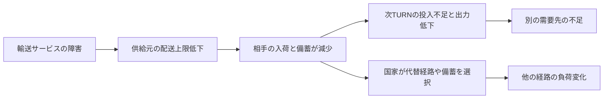

# V3 世界・取引・観測モデル案

> 2026-09-18レビュー更新：本書は初回設計の背景・出典資料として保持する。分類・配分規則・正式TURN・指標・実装段階の確定仕様は [IMPLEMENTATION_SPEC.md](IMPLEMENTATION_SPEC.md) を優先する。実装はユーザー確認待ち。

**未実装の設計。** 「現行」は[調査したR revision](ASSET_SURVEY.md)、「提案」は将来V3の契約を指す。既存結果の再解釈・再計算はしない。

## 資源の意味と所有

現行は7種類ともResourcePortfolio内の0〜100値で、countryとworld_poolに保存する。国は他国への供与・pool拠出・pool引出しを選べる。pool引出しは自国以外も受取先にでき、他国からの申請との競合を比例配分する。poolに独立した意思や所有者同意protocolはない。

V3では次の最小分類を提案する。新たな医療資源等は追加しない。

| 現行field | V3での扱い案 | 有限性・消費・再生 |
| --- | --- | --- |
| food | 保管可能なstock | 国別所有、容量上限、需要消費。生産を有効にする場合は投入・上限・供給源ledgerを明示 |
| fossil_fuel | 保管可能なエネルギー原料stock | 使用で減る。自動再生なし。シナリオに未定義の採掘を作らない |
| renewable_energy / nuclear | 発電capacityと当TURN供給可能なenergyを分離 | capacity自体を食料のように輸送しない。発電上限・停止率・投入条件を規定。既存値から物理単位を推定しない |
| grid_storage_resilience | grid capacity・蓄電上限・耐障害指標を区別 | 同一値を在庫・防御力・輸送力へ重複使用しない。未校正なら能力指標に留める |
| logistics | TURN当たり輸送／復興サービスcapacity | 予約して使用、翌TURN回復する稼働枠。機材所有の移転は別契約を設計するまで扱わない |
| funds_economy | 支払い残高とeconomy指標を分離 | 移転時は貸借保存。金融創造・価格市場・交換レートは本段階では導入しない |

最初の実装対象はfood、エネルギー供給、logisticsを中心に、資金支援が主質問に必要な場合だけfunds ledgerを接続する。上表は既存fieldの意味を整理する案であり、7種類の完全な物理経済を一度に実装する提案ではない。医療・新規鉱物・人口・架空の実物換算は追加しない。

所有国、保管場所、資源単位、capacity単位、需要単位、TURNの抽象時間をschemaに明記する。単位未校正なら「モデル資源単位」と表示し、現実ton等と混ぜない。生産capacityは新しい売買資源ではなく供給制約。外部源がない有限系は枯渇し得るため、8TURNで回復することを実装上の目的にしない。

### 会計不変条件

資源rごとに、国・pool・輸送中保管を含む残高総和について：

`期末総量 = 期首総量 + 明示された生産/外部流入 − 実消費 − 記録された損失/外部流出`

移転は総量を変えない。capacityは別に `使用＋予約 ≤ 稼働可能量` を検証する。需要Dと実消費Cを分け、`不足=max(0,D−C)`。消費は存在量までで、不足分を負在庫にも架空の消費にも変換しない。丸め単位と許容誤差はprotocol固定、誤差を隠す無条件clampは禁止。

預託poolは国からの任意拠出だけで増える。払い出しは事前公開した制度に従い、受取国の包括的受領同意または当TURN同意を要する。調整機関はpoolを直接操作しない。預託後の払い出し権・返還可否・自国引出し可否は実験条件として明記する。現行のself-withdrawalを不正と遡及認定しない。

## ネットワーク：辺と依存を分離

現行sampleの6辺：RES→FOOD(fossil)、NEUTRAL→FOOD(food)、ECON→FOOD(food)、ISLAND→SMALL(renewable)、ECON→FRAGILE(funds)、MIL→FRAGILE(logistics)。供給国から需要国への一段構造で、C→B→Aの生産連鎖はまだない。

V3の設計実体：

| 実体 | 必須の意味 |
| --- | --- |
| Country | ID、所有stock、能力、需要、被害、観測、選好、留保条件 |
| Supply contract | 当事者の同意、resource、数量範囲、有効期間、経路、取消条件 |
| Transport edge/path | 有向端点、共有capacity、利用可能性、遅延、使用権、障害状態。実地理と混同しない |
| Input dependency | 供給・復興に必要な投入量／サービス、出力上限、遅延、代替可能性 |
| Event | 発生源、対象、開始・終了、直接変化、根拠field、派生規則ID |
| Ledger | 各脚の予約・貸借・消費・損失、失敗理由、親transaction、source snapshot |

同じ辺を複数資源が使うなら容量換算係数を公開する。国別logisticsと経路capacityを独立した制約として同時に課す。資源ごとに容量を丸ごと再使用してはいけない。

多段伝播は、前TURN不足→次TURN投入可能量減少→生産／輸出上限低下→相手の消費不足という状態遷移で作る。途中国へ来た資源を同TURN内で無限に再貸付しない。第一段階は一つのTURN境界につき一段の更新、輸送中残高を明示。ゼロ遅延の多脚交換が必要なら別の決済protocolとして限定する。

これは**設計上の伝播構造**であり、既存runでこの連鎖が観測されたという図ではない。辺・係数・外乱をシナリオで固定しても、国家の選択や回復結末を固定しない。代替経路の使用は権利・容量・同意を検証する。

同時に複数の圧力を保持し、画面用に一つの代表eventを選んでも他の圧力を捨てない。状態由来の不足と、追加の外生災害を区別する。価格変化は価格モデル未採用なので計算・表示しない。緊張変化の係数も社会的因果の実証値とは扱わない。

## 自律判断と実行境界

地球調整機関は公開観測から提案と予測を返すだけ。国家は同じTURN開始snapshotを基に判断し、後から回答する国家に先行回答を漏らさない。拒否、無行動、備蓄は合法な選択。協力率を上げる誘導・回答書換え・再抽選は禁止。

現行応答3種を基本とする。別案は、理由文を執行可能取引と誤認しない。初期V3ではcatalogue内の代替行動を選ぶ方式までとし、複数ラウンド交渉は別途予算・protocol設計後にする。REJECT時に独立行動を許すかは現行と意味が変わるため、proposal responseとindependent intentを分離する仕様承認が必要。

`観測 → 提案 → catalogue生成 → choice/amount/公開reason → strict parse → materialization → 個別feasibility → 集約feasibility → 成立量 → atomic commit`

catalogueにはsnapshot hash・catalogue hash・契約versionを付ける。同じA003でも別snapshotでは別の行動になり得る。自由tuple出力へ戻さない。数量・単位・相手・経路・権限・受取容量・予算を検証する。候補一覧にあったことは、他国と同時に全量成立する保証ではない。

## 条件と原子的取引

現行の参加条件を「実際に援助が届く」という条件へ黙って読み替えない。V3は次を型で分離する。

- **参加条件**：指定当事者の同意、有効期限、自己の留保負担。単調な参加条件だけなら既存の同時最大固定点を利用できる。
- **履行条件**：指定transaction/受取国/resourceに対する最低**実現量**、交換の相手脚。公開理由文を条件式として実行しない。
- **配分規則**：部分配分可否と最低受取量。モデル回答後に都合よく変更しない。

要求量と実現量は別。部分履行可の契約では、成立した縮小量の全脚を同時にcommitする。全量条件の契約では全脚が成立するか全脚ゼロ。Aだけ減ってBに届かない更新は禁止。輸送遅延があればBへの着荷前に、同量を明示的な輸送中勘定へ貸記する。

数量条件を加えると参加集合は一般に単調ではない。参加者を増やすと比例配分が減り、最低量を割る場合があるため、現行固定点をそのまま拡張しない。

**初期設計案**：8国家・各1契約束に限定し、候補参加集合を列挙できる上限を保つ。各集合について同意・開始在庫・全脚・共有capacity・最低量を同時に満たすか判定する。部分配分は事前定義した充足率のmax-min規則等で一意化し、残る対称な候補間の選択は固定seedと安定transaction IDから決定する。採用する配分規則自体を制度条件として公開し、恒常性スコア最大化を隠れた中央目的にしない。離散丸め・不可能集合・タイブレークの仕様を第4段階で承認するまでsolverを実装しない。

合法候補があるのに計算資源不足になった場合は「不成立」と偽装せず技術失敗で停止する。成立可能集合が空なら、合法な無取引TURNとして記録する。順序を入れ替えても同じsnapshot・seed・回答集合から同じledgerを得る。

既存の自動network供給と任意支援は、V3では同じ予約ledgerを使う。前者は過去に同意済みの継続契約として扱い、設定辺があるだけで国のstockを無条件徴収しない。新規契約と継続契約の優先順位も制度条件として固定する。

## 正式TURN順序案

現行実経路：イベント決定→private views→Coordinator→8国家→条件集合→atomic actions→network移転・消費→指標→Evaluator→reconstruction→履歴・checkpoint。Evaluatorが復興を含むTURN末全体を評価したと断定してはいけない。

V3では次を正式順序案とする。

1. 前TURNのcommit済み状態を読む。到着予定・外生イベント・状態由来圧力を規則順に適用し、変更ledgerを残す。
2. 開始状態をfreeze。国別可視範囲・情報鮮度を生成。真値、観測値、予測値を区別する。
3. Coordinatorが提案。実行権限は付与しない。
4. 同一snapshotから各国catalogueを生成し、8国家の回答を集めて監査保存。一回答ごとの世界更新は禁止。
5. strict契約・choice復元・個別実行可能性を検証。一つでも不正なら停止し、未commitのTURNを正式結果にしない。
6. 全候補と継続契約を集約。参加・履行・在庫・輸送・受取・所有権を解き、成立／不成立理由を確定。
7. 移転・予約を私有の作業状態へatomicに適用。消費、生産、被害、復興を二重使用のないledgerで計算。
8. 保存則、非負、容量、条件履行を検証。世界／国家指標とTURN末snapshotを確定。
9. Evaluatorはこのsnapshotとledger hashを受け取り、コメントだけ返す。数値や次状態を上書きしない。
10. 監査・checkpointをdurableに保存してTURN完了をcommit。次TURNイベント候補を前状態との差と履歴から導く。

Evaluatorや保存が失敗した場合もcomputed stateを診断用に保存できるが、正式completed TURNへは含めない。ファイルはtemp→検証→atomic rename等の方式を後段で選定する。失敗runの途中状態を成功結果へ補完しない。

## 観測指標：少数の主軸と説明変数

恒常性＝外乱に対する機能維持・適応の軌跡。安定＝変化の小ささ。公平性＝採用した分配基準との関係。自律性＝許された判断と権限。回復力＝外乱後の機能回復。これらを同一スコアにしない。

| 軸 | 計算・入力案 | 分かること／限界 |
| --- | --- | --- |
| 既存Global Homeostasis | 現行は round(clamp(mean(food,energy,economy,environment,trust)−0.4×conflict)) | 仮定した集計の軌跡。善悪・物理的回復・公平性ではない。V3でも使うならversion固定し構成値併記 |
| 必須需要の不足 | 国/resourceごとのD−実消費、充足率C/D、累積不足。D=0はN/A | 実生活機能のモデル内代理。異種単位をそのまま合算しない |
| 資源分布 | 同資源の残高shareと国家別充足率分布 | 集中・偏在。人口や需要の差なしに「不公平」と断定しない |
| 依存集中 | 各需要国/resourceの供給share二乗和。計画と実現を別計算 | 供給集中。入荷ゼロ時はN/A＋不足、ゼロ集中で安全と扱わない |
| 経路負荷／供給網 | 実使用/利用可能capacity、停止辺、到達不能需要、代替経路数 | bottleneck・冗長性。capacity=0は停止として別表示 |
| 取引成立 | 成立契約数/有効提出数、要求量対実現量を資源別表示 | 全拒否・0提出はN/A。率が高いほど良いとはしない |
| 自律性／主権 | 国別自己burdenと既存主権指標、強制執行件数、拒否・条件・選択肢集合 | 制度上の自由と主観値。拒否率だけを自律性としない。選択肢数は質を表さない |
| trust / conflict | 決定論的更新の根拠項と国家別／世界値 | モデル関係の軌跡。実社会の信頼測定ではない |
| 回復 | 初期機能に対する回復比、閾値帯への復帰時間、不足面積 | 未回復は観測期間で右打切り。既存平均recovery_capacityは実測回復速度ではない |
| 波及 | 初期被害国外の不足発生時点・範囲、依存pathと各変化ledger | モデル内伝播の説明。対照worldlineなしで因果効果量とは言わない |

過剰反応／過少反応は標準の善悪指標にしない。事前固定の参照policyと必要量がある比較研究でのみ、追加輸出制限量・必要量超過・不足残存等を操作的に定義する。反実仮想は実runと別系列に保存する。

既存resilienceは国家のrecovery_capacity平均、resource_stabilityは資源値とpoolの集計であり時間変動を測っていない。名前だけで回復力・安定性の実証値にしない。V3では定義IDと式versionを必須にする。
